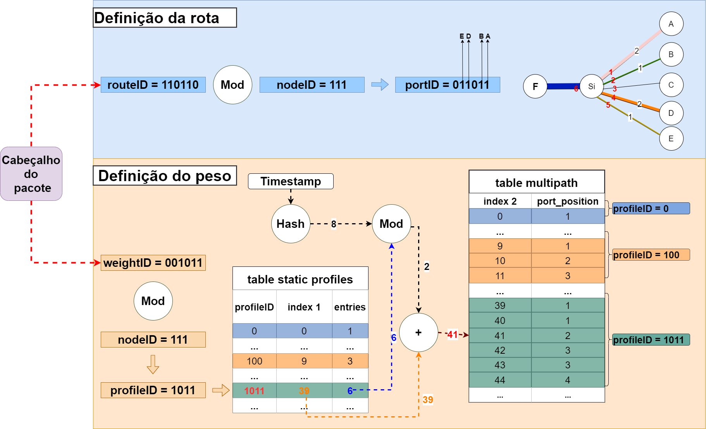

# MTS-PolKA: Divisão de tráfego multicaminho em proporção de peso com roteamento na fonte

O artigo apresenta a proposta inovadora chamada MTS_Polka para otimizar o tráfego em redes de datacenters. Introduz um método dinâmico de divisão de tráfego com rótulos routeIDs e wIDs no cabeçalho dos pacotes, utilizando tabelas estáticas nos switches para permitir ajustes flexíveis em tempo real, eliminando reconfigurações complexas. A abordagem emprega o roteamento na origem com o Protocolo M-Polka modificado, utilizando um sistema numérico de resíduos para roteamento de fonte sem armazenamento de estado e sem alterações nos hosts finais. O MTS_Polka destaca-se pela agilidade na (re)configuração de caminhos e pesos, com o plano de controle calculando identificadores de rota routeIDs, peso wIDs e nó nodeIDs. Experimentos demonstram a eficácia da solução, possibilitando reconfigurações ágeis de perfis de divisão de tráfego na origem, com potencial de melhorar o desempenho e eficiência em redes de datacenters.

## Funcionamento do MTS-Polka



Definição dos rótulos que serão usados por cada nó de núcleo para determinar o estado das portas de saída e perfis de divisão de tráfego correspondentes. Cada nó de núcleo possui duas tabelas estáticas com perfis de tráfego pré-definidos, que são selecionados a partir de operações com os rótulos routeID e wID de cada pacote. Cada switch de borda possui uma tabela de fluxos, previamente preenchida pelo controlador, que insere os rótulos routeID e weightID nos pacotes de cada fluxo. Essa tabela mapeia informações sobre o fluxo (e.g., endereço IP de destino, portas) em decisões de roteamento e balanceamento de carga. Posteriormente, esses r  ́otulos s  ̃ao usados em cada switch de núcleo para determinar o estado das portas de saída e selecionar os perfis de divisão de tráfego correspondentes, conforme Figura. A Figura exemplifica o funcionamento do plano de dados no MTS-PolKA para um switch de núcleo 𝑆𝑖 que possui 6 portas e distribuição de tráfego com proporção de pesos 2:1:2:1 para as portas que encaminham para os switches A, B, D e E, respectivamente.

No ingresso do pacote, deve ser realizada a operação de Definição de rota usando a operação de módulo (MOD) entre o routeID = 110110 e o nodeID = 111. O resultado desta operação serve para definir as portas de saída ativas (portID = 011011) que serão usadas no encaminhamento do pacote. Dessa forma, o tráfego é encaminhado pelas portas correspondentes aos bits de valor 1 em portID, com a análise realizada da direita para a esquerda. Assim, os pacotes são transmitidos para os switches A, B, D e E. Em seguida, é necessário descobrir qual o perfil de divisão de tráfego será usado no encaminhamento deste pacote para cada porta de saída ativa, conforme o weightID definido no pacote. Previamente, o controlador configurou, em cada switch de núcleo, o seu nodeID e duas tabelas estáticas (table static profiles e table multipath), que definem, respectivamente, os perfis de tráfego suportados e como o tráfego deve ser
distribuído pelas portas ativas conforme o perfil selecionado. Dessa forma, existem diversos perfis de tráfego disponíveis em cada switch de núcleo, que podem ser selecionados pela borda para os pacotes de cada fluxo, sem nenhuma configuração adicional nos switches de núcleo. A quantidade e a variedade de perfis suportados  ́e uma decis  ̃ao do plano de controle.

Seguindo no exemplo da Figura, a tabela table static profiles determina “como” a próxima tabela (table multipath) deverá ser acessada conforme o
perfil de divisão de tráfego selecionado. Ao empregar a operação de módulo entre weightID = 001011 e nodeID = 111, o switch 𝑆𝑖 obtém-se o profileID = 1011. Para esse perfil, na tabela table multipath existem 6 entradas (entries) que se iniciam a partir da posição 39 (index1). Na tabela table multipath, o perfil profileID = 1011 está representado na cor verde e a quantidade de linhas define os pesos para cada porta de saída ativa: 2 entradas para a primeira porta ativa (𝑝𝑜𝑟𝑡 𝑝𝑜𝑠𝑖𝑡𝑖𝑜𝑛 = 1), 1 entrada para a segunda porta ativa (𝑝𝑜𝑟𝑡 𝑝𝑜𝑠𝑖𝑡𝑖𝑜𝑛 = 2), 2 entradas para a terceira porta ativa (𝑝𝑜𝑟𝑡 𝑝𝑜𝑠𝑖𝑡𝑖𝑜𝑛 = 3) e 1 entrada para a quarta porta ativa (𝑝𝑜𝑟𝑡 𝑝𝑜𝑠𝑖𝑡𝑖𝑜𝑛 = 4), com um total de 6 entradas. Deste modo, o perfil profileID = 1011 deve dividir o tráfego na seguinte proporção: a primeira porta ativa deve receber 2/6 do tráfego, a segunda porta ativa deve receber 1/6 do tráfego, a terceira porta ativa deve receber 2/6 do tráfego e a quarta porta ativa deve receber 1/6 do tráfego. O número de entradas na table multipath representa justamente a proporção esperada e será explorada por uma função de hashing.

 Para espalhar os pacotes de um fluxo nas portas de saída ativas conforme a proporção definida no perfil, o switch 𝑆𝑖 executa uma função de hashing com o timestamp de ingresso do pacote. Neste exemplo, considere que o resultado do hashing é 8, e que este valor é submetido a uma operação de módulo inteiro pelo número de entradas em verde (𝑒𝑛𝑡𝑟𝑖𝑒𝑠 = 6 na table multipath), cujo resultado = 2. Este resultado deve ser adicionado ao  ́ındice (𝑖𝑛𝑑𝑒𝑥1 = 39), obtido na tabela table static profiles, resultando no  ́ındice 𝑖𝑛𝑑𝑒𝑥2 = 41 da table multipath. Por fim, essa linha do 𝑖𝑛𝑑𝑒𝑥2 = 41 indica que a segunda porta ativa (𝑝𝑜𝑟𝑡 𝑝𝑜𝑠𝑖𝑡𝑖𝑜𝑛 = 2) deve ser escolhida como porta de saída deste pacote específico. Neste exemplo, como o portID = 011011 foi previamente calculado na etapa de definição da rota, a segunda porta ativa significa que o pacote deve ser encaminhado pela porta de  ́ındice 2 ( ́ındices das portas comec ̧ am em 1, da direita para a esquerda no portID). Ainda na figura, a porta 2 representa o caminho de saída do pacote para o nó B. Aplicando o algoritmo de seleção de portas descrito atá aqui, e considerando a variação aleatória do hashing do timestamp de ingresso dos pacotes, o tráfego associado ao perfil profileID = 1011 ser  ́a espalhado entre as portas ativas com uma proporção de pesos igual a 2:1:2:1.

## Organização dos arquvivos

- \<artigo> - diretório contendo os experimentos do artigo. 
- \<m-polka> - diretório onde estão os aruivos em p4 de configuração dos switches edges e core.
- MTS-PolKA.pdf - Artigo em pdf.


## Execução iniciais
1. Download e instalação da VM:
   [[6.7GB Size] - Lubuntu 20.04 x64](https://drive.google.com/file/d/1oozRqFO2KjjxW0Ob47d6Re4i6ay1wdwg/view?usp=sharing) - Mininet-WiFi com P4 (_pass: wifi_).
   - Após o download, acesse a VM com as seguintes credenciais: user: wifi, pass: wifi
3. Clone do GitHub:
```sh
$ https://github.com/giancarloliver/MTS-Polka.git
```
```sh
$ make
```  
4. Executar topologia:
```sh
$ sudo python3 run_cenario_topology.py
``` 
5. Instalação da lib polka-routing:
```sh
$ python3 -m pip install polka-routing --user
``` 
  Ao instalar a lib, apareceu os alertas:
  Installing collected packages: WARNING: The script isympy is installed in '/home/wifi/.local/bin' which is not on PATH. Consider adding this directory to PATH or, if you 
  prefer to suppress this warning,   use --no-warn-script-location.                  
  Successfully installed mpmath-1.2.1 networkx-2.6.3 pandas-1.3.4 polka-routing-0.2.2 pytz-2021.3 sympy-1.9
  WARNING: You are using pip version 20.2.3; however, version 21.3 is available. You should consider upgrading via the '/usr/bin/python3 -m pip install --upgrade pip'         command.

## Observações:
- Para visualizar os logs, basta executar o código em um novo termina-<nome_switch>-log, como por exemplo, tail -f /tmp/bmv2-s1-log.
- Qualquer alteração realizada nos códigos do projeto, executar o comando make, para compilar o programa com as alterações realizadas.


## 1) Passo a passo da execução básica 

Para compilar os códigos P4 MTS-PolKA, você deve executar o seguinte comando:
```sh
$ cd m-polka/m-polka
$ make
$ cd ..
``` 
É importante notar que para cada modificação, temos que recompilar usando o comando anterior.

Gerar o routeid e o wid:
```sh
$ sudo python3 calc_routeid_wid.py
```

Para criar a topologia usando o Mininet, devemos executar o seguinte comando:
```sh
$ sudo python3 run_cenario_topology.py
```
## Relação do switches
s1 = s1_0
s2 = s2_0
s3 = s2_1
s4 = s2_2
s5 = s2_3
s6 = s2_4
s7 = s1_1

```python
#!/usr/bin/env python3
from polka.tools import calculate_routeid, print_poly
DEBUG=False

def _main():
    print("Insering irred poly (node-ID)")
    s = [
        [1, 0, 0, 0, 0, 0, 0, 0, 0, 0, 0, 1, 0, 1, 0, 1, 1], # s1
        [1, 0, 0, 0, 0, 0, 0, 0, 0, 0, 0, 1, 0, 1, 1, 0, 1], # s2
        [1, 0, 0, 0, 0, 0, 0, 0, 0, 0, 0, 1, 1, 1, 0, 0, 1], # s3
        [1, 0, 0, 0, 0, 0, 0, 0, 0, 0, 0, 1, 1, 1, 1, 1, 1], # s4
        [1, 0, 0, 0, 0, 0, 0, 0, 0, 0, 1, 0, 0, 0, 1, 1, 1], # s5
        [1, 0, 0, 0, 0, 0, 0, 0, 0, 0, 1, 0, 1, 0, 0, 1, 1], # s6
        [1, 0, 0, 0, 0, 0, 0, 0, 0, 1, 0, 0, 0, 1, 1, 0, 1], # s7
        [1, 0, 0, 0, 0, 0, 0, 0, 0, 1, 0, 1, 1, 1, 1, 0, 1], # s8
        [1, 0, 0, 0, 0, 0, 0, 0, 0, 1, 1, 0, 1, 0, 1, 1, 1], # s9
        [1, 0, 0, 0, 0, 0, 0, 0, 0, 1, 1, 1, 1, 0, 1, 0, 1], # s10
    ]
    print("From h1 to h2 ====")
    # defining the nodes from h1 to h2
    nodes = [
    s[0],
    s[1],
    s[2]
    s[4],
	s[5],
	s[6],
    ]
    # defining the transmission state for each node from h1 to h2
    o = [
    [1, 1, 0, 1, 1, 0],     # s1   
	[1, 0],  # s2
    [1, 0],  # s3
	[1, 0],	# s5	
	[1, 0],	#s6
	[0, 0, 0, 0, 0, 1], # s7
    ]
	print_poly(calculate_routeid(nodes, o, debug=DEBUG))
    
    print("From wid h1 to h2 ====")
    # defining the nodes from h1 to h2
    nodes = [
    s[0],
    s[1],
    s[2]
    s[4],
	s[5],
	s[6],
	]
    # defining the transmission weight for each node from h1 to h2
    w = [
    [0, 0, 1, 0, 1, 1],     # s1
    [0, 0],  # s2
    [0, 0],  # s3
	[0, 0],	# s5	
	[0, 0], # s6
    [0, 0, 0, 0, 0, 0, 0, 0],  # s7
    ]
    print("wid h1 to h2 ====")
    print_poly(calculate_routeid(nodes, w, debug=DEBUG))

    print("From h1 to h2 ====")
    # defining the nodes from h2 to h1
    nodes = [
    s[6],
    s[5],
    s[4],
	s[2],
	s[1],
	s[0],
    ]


  # defining the transmission state for each node from h2 to h1
    o = [
    [1, 1, 0, 1, 1, 0],     # s7
	[0, 1],  # s6
    [0, 1],  # s5
	[0, 1],	# s4	
	[0, 1], # s3
	[0, 1], # s2        
	[0, 0, 0, 0, 0, 1], # s1
    ]
    print("routeid h2 to h1 ====")
    print_poly(calculate_routeid(nodes, o, debug=DEBUG))

    print("From h1 to h2 ====")
    # defining the nodes from h1 to h2
    nodes = [
    s[6],
    s[5],
    s[4],
	s[2],
	s[1],
	s[0],
    ]

   # defining the transmission weight for each node from h2 to h1
    w = [
    [0, 0, 1, 0, 1, 1],     # s7
	[0, 0],  # s6
    [0, 0],  # s5
	[0, 0],	# s4	
	[0, 0], # s3
	[0, 0], # s2        
	[0, 0, 0, 0, 0, 0], # s1
    ]    
    print("wid h2 to h1 ====")
    print_poly(calculate_routeid(nodes, w, debug=DEBUG)) 
         
if __name__ == '__main__':
    _main()
```


Execute o arquivo calc_routeid-wid.py e obtenha o novo número do routeID wID calculado de h1 para h2.

```sh
m-polka $ python3 alc_routeid_wid
Insering irred poly (node-ID)
From h1 to h2 ====
routeid h1 to h2 ====
S=  [[1, 0, 0, 0, 0, 0, 0, 0, 0, 0, 0, 1, 0, 1, 0, 1, 1], [1, 0, 0, 0, 0, 0, 0, 0, 0, 0, 0, 1, 0, 1, 1, 0, 1], [1, 0, 0, 0, 0, 0, 0, 0, 0, 0, 0, 1, 1, 1, 0, 0, 1], [1, 0, 0, 0, 0, 0, 0, 0, 0, 0, 1, 0, 0, 0, 1, 1, 1], [1, 0, 0, 0, 0, 0, 0, 0, 0, 0, 1, 0, 1, 0, 0, 1, 1], [1, 0, 0, 0, 0, 0, 0, 0, 0, 1, 0, 0, 0, 1, 1, 0, 1]]
O=  [[1, 1, 0, 1, 1, 0], [1, 0], [1, 0], [1, 0], [1, 0], [0, 0, 0, 0, 0, 1]]
Len:  96
Poly (list):  [1, 1, 1, 0, 1, 1, 1, 0, 1, 0, 0, 0, 0, 1, 0, 0, 0, 0, 0, 0, 0, 1, 1, 1, 0, 0, 1, 0, 1, 0, 1, 1, 0, 0, 0, 0, 1, 1, 1, 0, 0, 0, 0, 1, 0, 1, 0, 0, 1, 1, 0, 0, 1, 0, 1, 0, 1, 0, 1, 1, 0, 0, 1, 0, 1, 0, 1, 1, 1, 1, 0, 0, 0, 0, 0, 1, 0, 0, 1, 0, 1, 0, 0, 1, 0, 1, 1, 0, 0, 0, 0, 0, 1, 0, 0, 1]
Poly (int):  73817044396459291349659850249
Poly (bin):  0b111011101000010000000111001010110000111000010100110010101011001010111100000100101001011000001001
Poly (hex):  0xee84072b0e14cab2bc129609
From h1 to h2 ====
wid h1 to h2 ====
S=  [[1, 0, 0, 0, 0, 0, 0, 0, 0, 0, 0, 1, 0, 1, 0, 1, 1], [1, 0, 0, 0, 0, 0, 0, 0, 0, 0, 0, 1, 0, 1, 1, 0, 1], [1, 0, 0, 0, 0, 0, 0, 0, 0, 0, 0, 1, 1, 1, 0, 0, 1], [1, 0, 0, 0, 0, 0, 0, 0, 0, 0, 1, 0, 0, 0, 1, 1, 1], [1, 0, 0, 0, 0, 0, 0, 0, 0, 0, 1, 0, 1, 0, 0, 1, 1], [1, 0, 0, 0, 0, 0, 0, 0, 0, 1, 0, 0, 0, 1, 1, 0, 1]]
O=  [[0, 0, 1, 0, 1, 1], [0, 0], [0, 0], [0, 0], [0, 0], [0, 0, 0, 0, 0, 0, 0, 0]]
Len:  95
Poly (list):  [1, 1, 1, 1, 0, 1, 0, 0, 0, 1, 1, 0, 1, 1, 1, 0, 1, 0, 0, 0, 0, 0, 1, 0, 0, 1, 0, 0, 1, 0, 0, 0, 1, 1, 0, 0, 0, 1, 0, 1, 1, 1, 0, 0, 0, 1, 1, 0, 0, 0, 1, 0, 0, 1, 0, 0, 0, 0, 1, 0, 1, 0, 1, 1, 1, 1, 1, 0, 0, 0, 1, 0, 0, 0, 0, 0, 1, 1, 1, 1, 0, 0, 1, 0, 0, 0, 1, 1, 0, 0, 0, 1, 0, 0, 0]
Poly (int):  37823969743312635090392551816
Poly (bin):  0b11110100011011101000001001001000110001011100011000100100001010111110001000001111001000110001000
Poly (hex):  0x7a37412462e31215f1079188
From h1 to h2 ====
routeid h2 to h1 ====
S=  [[1, 0, 0, 0, 0, 0, 0, 0, 0, 1, 0, 0, 0, 1, 1, 0, 1], [1, 0, 0, 0, 0, 0, 0, 0, 0, 0, 1, 0, 1, 0, 0, 1, 1], [1, 0, 0, 0, 0, 0, 0, 0, 0, 0, 1, 0, 0, 0, 1, 1, 1], [1, 0, 0, 0, 0, 0, 0, 0, 0, 0, 0, 1, 1, 1, 0, 0, 1], [1, 0, 0, 0, 0, 0, 0, 0, 0, 0, 0, 1, 0, 1, 1, 0, 1], [1, 0, 0, 0, 0, 0, 0, 0, 0, 0, 0, 1, 0, 1, 0, 1, 1]]
O=  [[1, 1, 0, 1, 1, 0], [0, 1], [0, 1], [0, 1], [0, 1], [0, 1], [0, 0, 0, 0, 0, 1]]
Len:  92
Poly (list):  [1, 1, 1, 1, 0, 1, 1, 0, 0, 0, 0, 1, 1, 0, 0, 0, 0, 1, 1, 0, 0, 1, 0, 0, 1, 0, 1, 1, 1, 0, 1, 1, 1, 1, 1, 0, 0, 1, 0, 0, 0, 1, 0, 0, 1, 1, 1, 1, 1, 1, 1, 1, 1, 1, 0, 0, 1, 0, 0, 1, 1, 1, 0, 0, 0, 0, 0, 0, 1, 1, 1, 1, 1, 1, 0, 1, 1, 0, 1, 1, 1, 1, 0, 1, 0, 0, 1, 0, 0, 0, 0, 1]
Poly (int):  4760175146147669529107217697
Poly (bin):  0b11110110000110000110010010111011111001000100111111111100100111000000111111011011110100100001
Poly (hex):  0xf61864bbe44ffc9c0fdbd21
From h1 to h2 ====
wid h2 to h1 ====
S=  [[1, 0, 0, 0, 0, 0, 0, 0, 0, 1, 0, 0, 0, 1, 1, 0, 1], [1, 0, 0, 0, 0, 0, 0, 0, 0, 0, 1, 0, 1, 0, 0, 1, 1], [1, 0, 0, 0, 0, 0, 0, 0, 0, 0, 1, 0, 0, 0, 1, 1, 1], [1, 0, 0, 0, 0, 0, 0, 0, 0, 0, 0, 1, 1, 1, 0, 0, 1], [1, 0, 0, 0, 0, 0, 0, 0, 0, 0, 0, 1, 0, 1, 1, 0, 1], [1, 0, 0, 0, 0, 0, 0, 0, 0, 0, 0, 1, 0, 1, 0, 1, 1]]
O=  [[0, 0, 1, 0, 1, 1], [0, 0], [0, 0], [0, 0], [0, 0], [0, 0], [0, 0, 0, 0, 0, 0]]
Len:  94
Poly (list):  [1, 1, 1, 0, 1, 1, 1, 0, 0, 1, 1, 0, 1, 0, 1, 1, 1, 0, 0, 0, 0, 0, 0, 0, 0, 0, 0, 1, 1, 0, 1, 1, 0, 0, 0, 1, 1, 0, 0, 0, 0, 1, 1, 1, 0, 0, 1, 0, 0, 1, 0, 1, 0, 0, 1, 1, 0, 0, 1, 1, 0, 0, 1, 0, 0, 0, 1, 0, 0, 1, 1, 0, 0, 0, 0, 1, 1, 0, 0, 0, 1, 1, 0, 0, 1, 0, 0, 1, 1, 1, 0, 1, 0, 0]
Poly (int):  18446848090728087715511153268
Poly (bin):  0b1110111001101011100000000001101100011000011100100101001100110010001001100001100011001001110100
Poly (hex):  0x3b9ae006c61c94cc89863274
```

Depois de gerar o routeID para o estado das portas de saída e o wID para o perfis de divisão de tráfego de cada caminho, devemos adicionar o routeID e o wID apropriado relacionado ao destino. Por exemplo, para o destino "h2", a seguinte linha em "e1" (nó edge 1) deve ser modificada da seguinte forma:


```sh
m-polka $ cd m-polka/config/
m-polka/m-polka/config $ cat e1-commands.txt
```


Altere o arquivo e1-commands.txt, o routeID do 10.0.2.2/32 para 817044396459291349659850249 37823969743312635090392551816.:
```sh
default tunnel_encap_process_sr tdrop
table_add tunnel_encap_process_sr add_sourcerouting_header 10.0.1.1/32 => 1 0 00:00:00:00:01:01 0 0
table_add tunnel_encap_process_sr add_sourcerouting_header 10.0.2.2/32 => 2 1 00:00:00:00:02:02 73817044396459291349659850249 37823969743312635090392551816
```

Altere o arquivo e2-commands.txt, o routeID do 10.0.1.1/32 para 4760175146147669529107217697 18446848090728087715511153268.:
```sh
table_set_default tunnel_encap_process_sr tdrop
table_add tunnel_encap_process_sr add_sourcerouting_header 10.0.2.2/32 => 1 0 00:00:00:00:02:02 0 0
table_add tunnel_encap_process_sr add_sourcerouting_header 10.0.1.1/32 => 2 1 00:00:00:00:01:01 4760175146147669529107217697 18446848090728087715511153268
```

No terminal que estiver executando a topologia no Mininet, execute 1 ping de um host para outro, exemplo: h1 ping h2 -c 1 e analisar log para entender a execução.
Abra novo terminal para acompanhar os logs de execução:
Para verificar o nome do arquivo: 
```sh
$ cd ~
$ ls /tmp
$ tail -f /tmp/bmv2-<nome_switch>-log
```


